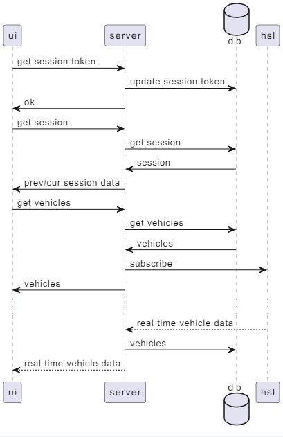

# HSL live activity demo

[DEMO](https://hsl.ubi.dynu.com/)
[OAS](https://hsl.ubi.dynu.com/doc)

## Plan

Utilize [HSL realtime positional data](https://digitransit.fi/en/developers/apis/4-realtime-api/vehicle-positions/) to display vehicle positioning in a map. User should be able to position a rectangle within the vehicles are tracked.

## Stack

UI: **react** based UI. **react-query** along with **orval** to generate API layer and mocks from openAPI. **playwright** for unit/e2e testing. Unit tests utilize **msw** mocking. 

Server: **prisma** (postgresql) for database management. **fastify** as server middleware. **mqtt** to communicate with HSL. **tap** for unit testing.

Deployed as **docker** image.

## Architecture

Components

```plantuml
node ui
node server
database db
cloud hsl

server <.. hsl :mqtt
server ..> ui : ws
server <- ui : http
server -> db 
```


Sequence

```plantuml
participant ui
participant server
database db
participant hsl

ui->server : get session token
db<-server : update session token
ui<-server : ok
ui->server : get session
db<-server : get session
db->server : session
ui<-server : prev/cur session data
ui->server : get vehicles
db<-server : get vehicles
db->server : vehicles
hsl<-server : subscribe
ui<-server : vehicles
...
hsl-->server : real time vehicle data
db<-server : vehicles
ui<--server : real time vehicle data
```



## Schemas

See prisma file for details

Vehicle 
````
  id             String @id @unique > vehicle id + operator as vehicle id not unique in HSL
  ... vehicle data, see HSL ...
````

Session
````
  id             String @id @unique > session cookie
  latitudeStart  Float? > for bounding box in UI
  longitudeStart Float? > for bounding box in UI
  latitudeEnd    Float? > for bounding box in UI
  longitudeEnd   Float? > for bounding box in UI
````

## Todo

- send updates to clients via Websocket instead of polling
- implement service down when mq not responsive
- server side integration tests

## Local environment setup

- Node => 18.13.0
- pnpm (`npm i -g pnpm`)
- add .env files if overrides needed
- exec `pnpm start`

## Running in local docker

- `docker build . -t TAG`
- `docker run -d TAG`